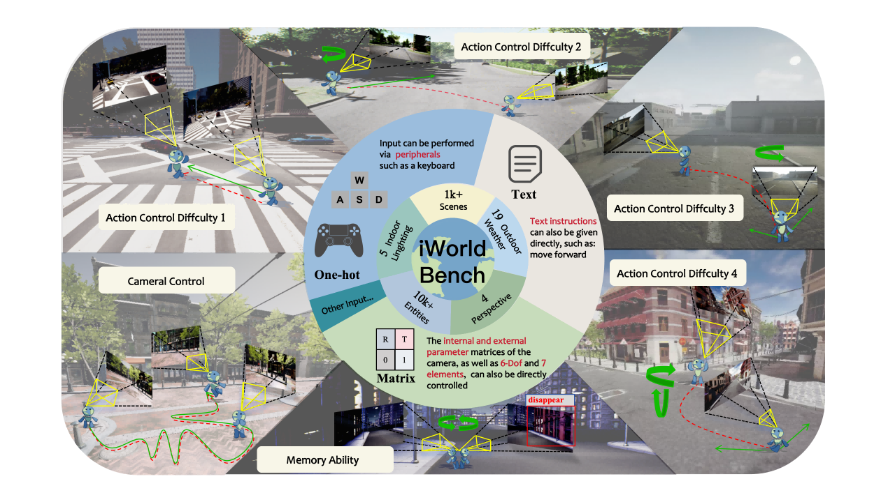

# iWorldBench

[](https://opensource.org/licenses/Apache-2.0)
[](https://iworld-bench.com/)
[](https://arxiv.org/abs/2605.03941)
[](https://huggingface.co/datasets/EmbodiedCity/iWorld-Bench-Dataset)
[](https://huggingface.co/spaces/EmbodiedCity/iWorld-Bench)

**News:** Congratulations to the iWorldBench team! iWorldBench has been accepted to **ICML 2026**.

**Important Dates**

- **Paper accepted:** May 1, 2026
- **Code release:** May 18, 2026
- **Dataset release**: May 19, 2026

iWorldBench is a benchmark for evaluating camera-controllable video generation models. This release provides the evaluation code, packaged metadata, camera-trajectory resources, and reference inference adapters needed to run the benchmark.

## Overview



## Repository Structure

```text
iWorldBench/
├── LICENSE
├── README.md
├── README_metrics.md                  # Detailed metric definitions and dependencies
├── README_videoxfun.md                # Full VideoX-Fun reference inference workflow
├── requirements.txt
├── unified_video_metrics.py           # Metric API and CLI implementation
├── run_iworldbench_evaluation.py      # One-command evaluation wrapper
├── run_videoxfun_inference.py         # Reference VideoX-Fun integration wrapper
├── _vipe_worker.py                    # VIPe subprocess worker
├── index_att2.py                      # Camera-control evaluation implementation
├── index_revise_pro_plus_c_h.py       # Motion and visual-quality metric implementation
├── inference_demos/
│   ├── README.md
│   ├── demo_common.py
│   ├── run_ac3d_demo.py
│   ├── run_cameractrl_demo.py
│   ├── run_cami2v_demo.py
│   ├── run_cogvideox_demo.py
│   ├── run_hunyuan_demo.py
│   ├── run_hyworldplay_demo.py
│   ├── run_matrixgame_demo.py
│   ├── run_motionctrl_demo.py
│   ├── run_realcami2v_demo.py
│   ├── run_videox_demo.py
│   ├── run_wan_demo.py
│   └── run_yume_demo.py
├── Process/
│   ├── README.md                      # Dataset preprocessing overview
│   ├── 7-Scenes/
│   ├── NCLT/
│   ├── NuSence/
│   ├── Princeton365/
│   ├── SpatialVID/
│   ├── TartanAir/
│   └── realestate10k/
├── camera_trajectories/
│   ├── inference_txt/                 # Camera-control TXT files for Diff/Mem inference
│   ├── reference_npz/                 # Reference NPZ files for trajectory tolerance
│   ├── source_camera_txt/             # Original source-camera TXT files
│   ├── source_reference_npz/          # Original source-camera NPZ references
│   ├── action_with_text_description.csv
│   └── memory_dic_with_text_description.csv
├── dataset/
│   └── all_pack/
│       ├── assets/                    # First-frame images
│       ├── metadata.csv               # Diff/Mem metadata with relative paths
│       ├── camera_following_metadata.csv
│       └── videoxfun_diff.csv         # VideoX-Fun-compatible Diff CSV
└── figs/
    └── overview.png
```

## Documentation

- [README_metrics.md](README_metrics.md): detailed metric definitions, dependency setup, CLI usage, and API examples.
- [README_videoxfun.md](README_videoxfun.md): full VideoX-Fun reference inference workflow.
- [inference_demos/README.md](inference_demos/README.md): dry-run adapters for external model repositories and command construction.
- [Process/README.md](Process/README.md): dataset preprocessing pipeline notes.

## Installation and Deployment

```bash
# Clone the repository
git clone https://github.com/EmbodiedCity/iWorld-Bench.git
cd iWorldBench

# Install dependencies
pip install -r requirements.txt
```

Trajectory-based metrics use VIPe, and VBench-backed metrics use VBench. Install them separately when running the full benchmark, then point iWorldBench to your local checkouts:

```bash
export VIPE_ROOT=/path/to/vipe
export VBENCH_ROOT=/path/to/VBench
```

For detailed dependency notes, see [README_metrics.md](README_metrics.md).

## Dataset Download

The inference dataset (first-frame images and metadata CSVs) is hosted on Hugging Face. After cloning and entering the repository, download the dataset directly:

```bash
pip install huggingface_hub
huggingface-cli download EmbodiedCity/iWorld-Bench-Dataset \
  --repo-type dataset \
  --include "dataset/all_pack/**" \
  --local-dir .
```

This places the data at `dataset/all_pack/` inside the repository, ready for inference.

To download only the metadata CSVs (without first-frame images):

```bash
huggingface-cli download EmbodiedCity/iWorld-Bench-Dataset \
  --repo-type dataset \
  --include "dataset/all_pack/*.csv" \
  --local-dir .
```

## Inference

iWorldBench evaluates generated videos. You can use your own model runner as long as it reads the packaged metadata and saves generated videos to an output directory.

For a complete reference implementation using VideoX-Fun, see [README_videoxfun.md](README_videoxfun.md). Minimal command shape:

```bash
python3 run_videoxfun_inference.py \
  --csv dataset/all_pack/metadata.csv \
  --assets-root dataset/all_pack \
  --source-videos-dir /path/to/source_videos \
  --output-dir /path/to/output \
  --videoxfun-root /path/to/VideoX-Fun \
  --model-path /path/to/model \
  --gpu 0
```

Additional model-specific dry-run adapters are available under `inference_demos/`. They validate paths, CSV fields, and external-model command construction without running generation:

```bash
python3 inference_demos/run_videox_demo.py --max-samples 3
python3 inference_demos/run_hyworldplay_demo.py --max-samples 3
```

## Evaluation

The evaluator takes a directory of generated videos and writes CSV reports under `<eval_output>/reports/`.

Action-control / `Diff` evaluation:

```bash
python3 run_iworldbench_evaluation.py \
  /path/to/diff_generated_videos \
  /path/to/eval_output \
  --metric action_control \
  --camera-txt-dir camera_trajectories/inference_txt \
  --source-npz-dir camera_trajectories/reference_npz \
  --vbench-gpu 0
```

Memory / `Mem` evaluation:

```bash
python3 run_iworldbench_evaluation.py \
  /path/to/mem_generated_videos \
  /path/to/eval_output \
  --metric memory_ability
```

Camera-following evaluation for trajectory-input models:

```bash
python3 run_iworldbench_evaluation.py \
  /path/to/camera_following_generated_videos \
  /path/to/eval_output \
  --metric camera_following \
  --source-npz-dir camera_trajectories/source_reference_npz \
  --vbench-gpu 0
```

Complete evaluation:

```bash
python3 run_iworldbench_evaluation.py \
  /path/to/generated_videos \
  /path/to/eval_output \
  --metric all \
  --camera-txt-dir camera_trajectories/inference_txt \
  --source-npz-dir camera_trajectories/reference_npz \
  --vbench-gpu 0
```

Use `python3 run_iworldbench_evaluation.py --help` for all CLI options. Use [README_metrics.md](README_metrics.md) for metric definitions and dependency details.

## Troubleshooting

- **No videos found:** check that the input directory contains supported video files.
- **VIPe or VBench not found:** set `VIPE_ROOT` or `VBENCH_ROOT` to your local checkout.
- **Trajectory files not found:** keep the packaged `camera_trajectories/` directory next to the evaluation scripts, or pass explicit paths.
- **More details:** see [README_metrics.md](README_metrics.md).

## License

This project is licensed under the Apache License 2.0. See [LICENSE](LICENSE) for details.

## Acknowledgments

- [VIPe](https://github.com/Snap-Research/vipe) for camera trajectory estimation.
- [VBench](https://github.com/Vchitect/VBench) for imaging-quality and motion-smoothness evaluation.

Reference inference adapters may call external model repositories that are not vendored here. See [inference_demos/README.md](inference_demos/README.md) for original repository links and citation/license notes.

## Citation

If you find iWorldBench useful for your research, please cite:

```bibtex
@misc{fang2026iworldbenchbenchmarkinteractiveworld,
      title={iWorld-Bench: A Benchmark for Interactive World Models with a Unified Action Generation Framework}, 
      author={Jianjie Fang and Yingshan Lei and Qin Wan and Ziyou Wang and Yuchao Huang and Yongyan Xu and Baining Zhao and Weichen Zhang and Chen Gao and Xinlei Chen and Yong Li},
      year={2026},
      eprint={2605.03941},
      archivePrefix={arXiv},
      primaryClass={cs.CV},
      url={https://arxiv.org/abs/2605.03941}, 
}
```
